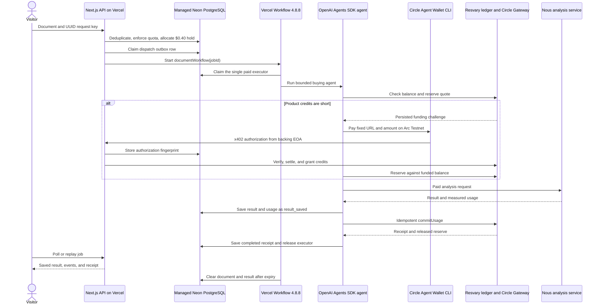
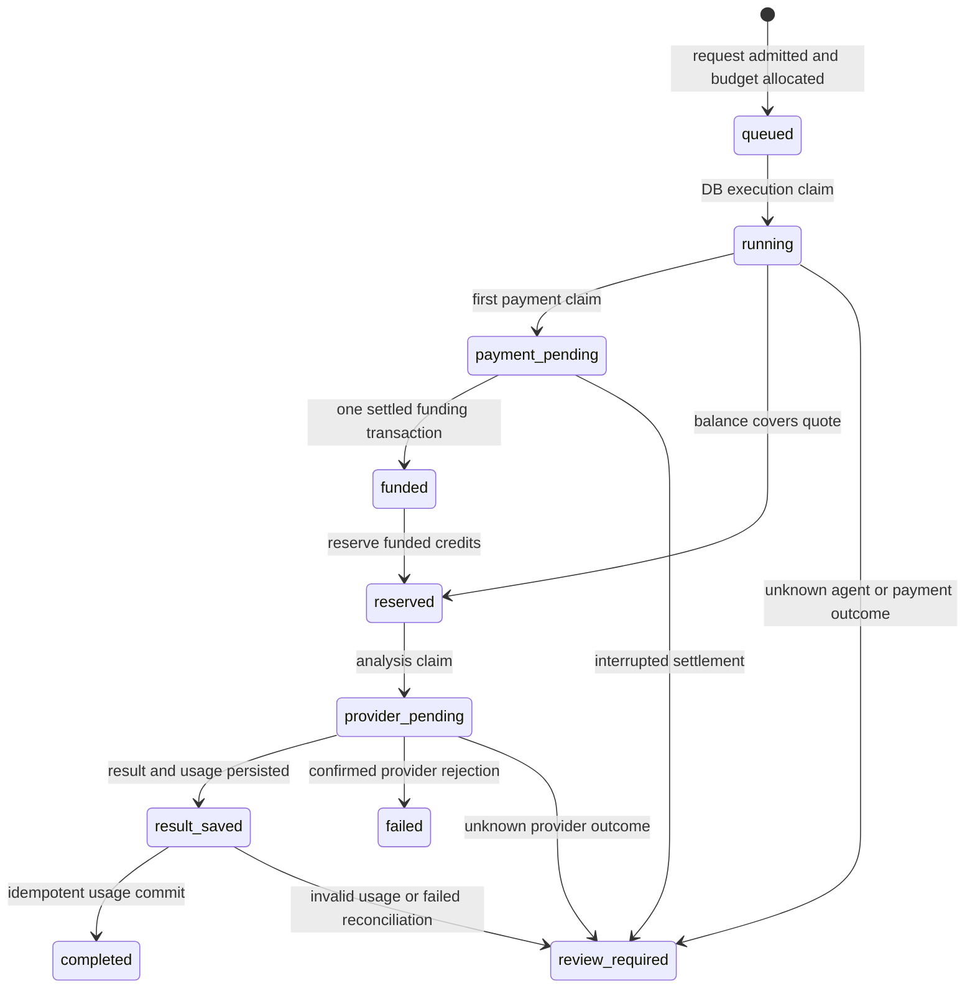

# Resvary agent demo architecture

Resvary runs a Next.js production deployment in the dedicated Vercel project `resvary-agent-demo`. Vercel Workflow `4.8.8` coordinates durable execution, and a managed Neon PostgreSQL database in `fra1` holds job state, the credit ledger, idempotency records, quotas, and budget allocation. Two live analyses verified the payment, credit, usage, and replay path; [sanitized evidence](../apps/agent-demo/public/proofs/2026-09-10.json) records their identifiers and amounts.

The OpenAI Agents SDK remains the agent runtime. The production provider profile sends the agent loop to Nous `qwen/qwen3.8-flash` and sends the paid document-analysis request to Nous `openai/gpt-4.1-mini` through a bounded OpenAI-compatible transport.

## Paid request sequence

## Components and trust boundaries

| Component                   | Responsibility                                                                         | Sensitive material                                                                   |
| --------------------------- | -------------------------------------------------------------------------------------- | ------------------------------------------------------------------------------------ |
| Next.js web and API         | Session creation, job admission, status, result replay, internal payment endpoint      | Session HMAC secret, database access                                                 |
| Vercel Workflow             | Durable dispatch, serialized execution, supervisor, 24-hour wake-up                    | Opaque job ID, returned phases, expiry timestamp                                     |
| Neon PostgreSQL             | Job state, single executor claim, budget, quotas, authorization hashes, Resvary ledger | Submitted text and result until expiry                                               |
| OpenAI Agents SDK           | Bounded tool-using buying agent                                                        | Document stays behind server tools; the agent receives a job prompt and tool results |
| Nous                        | Agent inference and paid document analysis                                             | Provider requests and usage under the selected profiles                              |
| Circle CLI                  | Agent Wallet readiness and constrained payment                                         | Decrypted Testnet session inside one private temporary home                          |
| Resvary and Gateway adapter | Quote, funding intent, credit grant, reservation, usage commit, receipt                | Payment and ledger identifiers, no document text                                     |

The browser never supplies a customer ID. The API derives it from a signed 24-hour `HttpOnly` cookie. Public mutation routes require the configured origin. The internal top-up route accepts a job-specific bearer token generated from the server secret.

## Durable ownership and serialization

The database enforces one paid execution across all Vercel instances:

1. `claimDispatch` writes a dispatch token before calling `workflow.start`. If start acknowledgement disappears, another request or maintenance run may enqueue the job after 90 seconds.
2. `claimWorkflow` locks the singleton `agent_demo.executor` row and the job row in one transaction. It grants ownership only when the job remains queued, unexpired, and unclaimed.
3. The executor row blocks other jobs while one agent run owns the shared Circle wallet. Duplicate Workflow deliveries return `busy` or `finished` before an external call.
4. `finishWorkflow` clears the singleton owner after the engine returns. A failed final database write leaves the token in place so the supervisor can stop the job for review.

The agent engine uses a 230-second abort signal under Vercel's 300-second function limit. It allows eight agent turns, serializes tool calls, and checks remaining time before payment and analysis operations.

## Workflow and supervisor

`documentWorkflow(jobId)` runs two branches:

- `processJob` attempts to acquire the executor every ten seconds for up to ten minutes. If the queue remains occupied, it marks the still-queued job failed without starting analysis.
- `superviseAndExpire` checks persisted state every five minutes for up to five attempts. `reconcileWorkflows` marks a claim older than ten minutes `review_required` and releases the singleton executor. The branch then sleeps until `expires_at` and runs content cleanup.

The execution step sets `maxRetries = 0`. It converts an escaping engine error into `FatalError`, because a platform retry could repeat a payment or provider request whose outcome the application did not record. Database-only steps raise `RetryableError` for metadata reads, saved-result reconciliation, queue closure, and content cleanup.

The authenticated `/api/internal/maintenance` route supplies a second database-only recovery path. It clears expired content, reconciles stale Workflow ownership, commits `result_saved` jobs, and drains abandoned dispatch rows. `vercel.json` does not schedule that route, so production operations need an external scheduler or an operator invocation.

## Job state and recovery

| Outcome                                            | Application response                                                  | Automatic retry         |
| -------------------------------------------------- | --------------------------------------------------------------------- | ----------------------- |
| Confirmed success                                  | Save provider output, commit measured usage, store receipt            | No second external call |
| Confirmed service-provider rejection               | Release the product-credit reservation and mark the job failed        | No                      |
| Transient database failure in a database-only step | Vercel Workflow retries with a fixed delay                            | Yes, database-only      |
| Saved result with an incomplete ledger commit      | Reuse the saved usage, reservation ID, usage event ID, and commit key | Yes, no provider call   |
| Payment or provider outcome unknown                | Preserve identifiers and mark `review_required`                       | No                      |
| Execution claim older than ten minutes             | Mark `review_required`, then free the shared executor                 | No                      |

The payment route stores a SHA-256 fingerprint, nonce, and validity deadline of the first authorization before calling the facilitator, without retaining its signature. If the ledger already contains a settled funding transaction, a duplicate request returns that transaction. If no transaction exists after an uncertain settlement, the route refuses another authorization. An operator must reconcile Circle and ledger records.

The demo configures a 30-day authorization window to match Circle CLI `1.0.0`. The adapter still compares accepted requirements strictly and keeps its funding-intent expiry unchanged. Gateway accepts nanopayments before batch settlement onchain. The ledger's funding status `settled` describes the successful facilitator response; a separate Gateway transfer lookup establishes batch status and, when available, the onchain transaction hash.

Resvary cannot guarantee exactly-once execution at Circle or an AI provider. Database claims and idempotency keys prevent automatic duplicate work after the application records enough state. Unknown external outcomes require human review.

## Circle wallet identity and session snapshot

The Circle CLI receives the Agent Wallet SCA through `--address`. Circle Gateway reports a separate backing EOA and uses that EOA as the x402 authorization source. Readiness and payment validation require:

- the configured `AGENT_DEMO_WALLET` SCA in the Testnet Agent Wallet list;
- the configured `AGENT_DEMO_PAYER` EOA as `backingEOA` and authorization `from`;
- a distinct `AGENT_DEMO_SELLER` address;
- at least `0.05` Testnet Gateway USDC.

The operator exports only the CLI Testnet Agent Wallet slot and accepted-terms record. The exporter encrypts the snapshot with AES-256-GCM and a random 32-byte key. Vercel stores the encrypted bundle and key as separate Sensitive variables. Each function call decrypts them under a unique private directory below `tmpdir()` (`/tmp` on Vercel), supplies only a minimal child environment to Circle CLI, and removes the directory after the command.

The current snapshot expires on October 7, 2026. Code rejects a snapshot within two minutes of expiry. Circle CLI `1.0.0` does not refresh this snapshot on Vercel, so operations must rotate it before the recorded timestamp. The October date describes this snapshot and does not define a seven-day session promise.

The deployment keeps Circle CLI as a standalone Node executable. Runtime resolution starts from the deployed application package, and `next.config.ts` uses `@vercel/nft` to trace the CLI dependency set for the target operating system. This boundary includes optional native files without sending the CLI executable graph through the ordinary Turbopack module bundle.

## Provider boundary

The provider adapter allowlists provider and model pairs with fixed tariff snapshots. It rejects redirects, streaming, multiple candidates, unknown routes, oversized bodies, excess output limits, and invalid usage. It disables hidden reasoning for the selected Qwen model so the application can count billed completion tokens.

The selected production pair is:

| Role         | Provider | Model                 | Stored tariff snapshot per million input/output tokens |
| ------------ | -------- | --------------------- | ------------------------------------------------------ |
| Agent        | Nous     | `qwen/qwen3.8-flash`  | `$0.15` / `$0.47`                                      |
| Paid service | Nous     | `openai/gpt-4.1-mini` | `$0.40` / `$1.60`                                      |

The application still uses `@openai/agents` `0.17.1` and `openai` `7.10.0`. `OpenAIProvider` points the agent runner at the selected OpenAI-compatible Nous client. The separate service call uses the same bounded client.

A Hyperbolic key probe returned HTTP 401. That response proves rejection, not compatibility. Hyperbolic remains an allowlisted code path for local development but has no live verification status for this deployment.

## Budget and product credits

PostgreSQL stores the demo budget in micro-USD. The ceiling equals `10,000,000` units (`$10.00`). Provider probes created `19,390` units (`$0.019390`) of conservative pre-call holds, while the provider reported `$0.00083109` in total probe spend. A fresh production database must seed the holds through `AGENT_DEMO_INITIAL_SPEND_UNITS` before the budget row exists.

Each accepted request increments allocated budget by `400,000` units (`$0.40`). The code never decrements that amount, even when the provider charges less or the job fails. After the known probe holds, the database can accept 24 job holds. The 25th would exceed the ceiling.

The visitor-facing Resvary ledger uses a separate product tariff of `$2` per million input tokens and `$8` per million output tokens. It reserves the maximum quote, charges measured service usage, and releases unused product credits. The receipt represents this product tariff. It does not represent the Nous invoice or the fixed demo-budget allocation.

## Retention and disclosure

The job row stores document and result text until `expires_at`, which defaults to 24 hours after creation. Cleanup sets both fields to `NULL`. Events, usage, receipt, ledger references, quota counters, input hashes, and budget allocation remain. Operators must configure Neon backup retention to match the public privacy statement because row cleanup cannot erase prior backups.

The provider calls set `store:false`, and the Agents SDK runner disables tracing. Those settings do not replace a review of Nous retention terms.

The production URL <https://agent.resvary.xyz> serves the verified live prototype. The Vercel URL remains available as a fallback. Source validation passed 43 agent-demo tests, 17 nanopayment and credit-gate tests, and the compiled Workflow browser E2E. Linux deployment, Neon migrations, and operator and cloud Circle readiness passed. The live browser run completed funding, two analyses, receipt checks, and replay before its final isolation check hit a session-creation timing race. A separate read-only production isolation test passed after the test wait was corrected.

At 22:39 UTC on September 9, the remaining budget upper bound was `$8.780610`: the `$10` ceiling less `$0.019390` of probe holds and three `$0.40` job holds. One earlier job failed before Gateway verification because of the CLI authorization-window mismatch; an operator confirmed no transfer and retained its budget hold. The successful payment's Gateway status was `received` with no onchain hash. Batch confirmation and real 24-hour content cleanup remain unverified.
