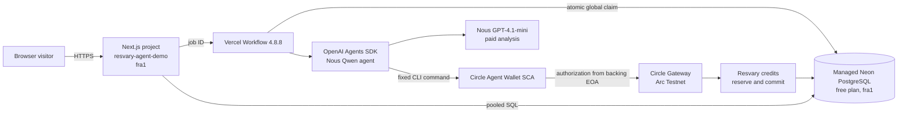

# Resvary agent demo Vercel runbook

This runbook covers the dedicated `resvary-agent-demo` Vercel project, its managed Neon PostgreSQL database, Vercel Workflow `4.8.8`, and the Circle Testnet Agent Wallet session. It does not authorize production deployment or paid calls.

## Production topology



## Current release gates

| Gate                                                        | Status                                                                                                    |
| ----------------------------------------------------------- | --------------------------------------------------------------------------------------------------------- |
| Vercel project named `resvary-agent-demo`                   | Created                                                                                                   |
| Production URL `https://agent.resvary.xyz`                  | Assigned to a `READY` Linux production deployment; the Vercel URL remains available as a fallback         |
| Managed Neon PostgreSQL free database in `fra1`             | Provisioned and migrated                                                                                  |
| Source validation                                           | 43 agent-demo tests, 17 nanopayment and credit-gate tests, and compiled Workflow browser E2E passed       |
| Nous `qwen/qwen3.8-flash` agent profile                     | Selected                                                                                                  |
| Nous `openai/gpt-4.1-mini` analysis profile                 | Selected                                                                                                  |
| Hyperbolic compatibility                                    | Failed credential probe with HTTP 401; unverified                                                         |
| Circle SCA, backing EOA, session, and Gateway balance check | Operator and deployed-cloud readiness passed                                                              |
| Circle CLI packaging fix                                    | Warning-free local and Linux Vercel builds passed                                                         |
| Paid analysis and replay                                    | Two live analyses completed, one real 0.02 Testnet USDC top-up; replay and leftover-credit reuse verified |
| Session isolation                                           | Separate read-only production browser test passed                                                         |
| Gateway batch finality and real 24-hour cleanup             | Not yet observed                                                                                          |

The current deployment accepts new jobs within the persistent budget. For a fresh deployment, keep `AGENT_DEMO_ACCEPTING=false` until readiness passes, then enable one controlled paid verification run. See the [evidence and test qualifications](ethonline-continuity.md#evidence-status).

An earlier Vercel build reached `@circle-fin/cli`, then `@open-wallet-standard/core`, and failed on a native/non-ECMAScript asset. The implemented boundary resolves the CLI from the Node runtime and uses `@vercel/nft` to trace its dependency files for the target operating system. Local and Linux Vercel builds pass. This build result proves packaging, not the paid path.

## 1. Check local source and dependencies

Run from the repository root:

```sh
npm ci --ignore-scripts
npm run build:core
npm test --workspace @resvary/circle
npm test --workspace @resvary/agent-demo
npm run build --workspace @resvary/agent-demo
```

Run the compiled browser test in Workflow mode. The harness defaults to the legacy worker unless you set this variable:

```powershell
$env:AGENT_DEMO_TEST_EXECUTION_MODE='workflow'
npm run test:e2e --workspace @resvary/agent-demo
Remove-Item Env:\AGENT_DEMO_TEST_EXECUTION_MODE
```

Run PostgreSQL integration tests only against a disposable database whose name ends in `_test`. Do not point `TEST_DATABASE_URL` at Neon production.

Confirm these pinned runtime dependencies in `apps/agent-demo/package.json`:

- `workflow` `4.8.8`
- `@openai/agents` `0.17.1`
- `openai` `7.10.0`
- `@circle-fin/cli` `1.0.0`

## 2. Check the Vercel and Neon boundary

Set the Vercel project root to `apps/agent-demo`. Confirm that `vercel.json` reports the Next.js framework, `fra1`, the monorepo build command, and 300-second limits for the API and Workflow step routes.

For an authorized deployment from the repository root, pass the region explicitly. A root-level CLI deployment otherwise used `iad1` despite the nested app configuration:

```sh
vercel deploy --prod --yes --regions fra1 --scope horn111s-projects
```

Inspect the deployed functions and confirm `fra1`. The build machine may run in another region.

Connect `DATABASE_URL` to the managed Neon PostgreSQL database in `fra1`. The Workflow runtime opens a pool with at most three connections and short idle timeouts. The database claim code works through transaction poolers because it stores ownership in rows instead of connection-scoped advisory locks.

Run the migrations once with production configuration and `AGENT_DEMO_ACCEPTING=false`:

```sh
npm run migrate --workspace @resvary/agent-demo
```

The migration creates both the Resvary ledger schema and the separate `agent_demo` schema. Set `AGENT_DEMO_INITIAL_SPEND_UNITS=19390` before the first migration of a fresh database. Later changes to that variable do not rewrite the existing budget row.

## 3. Configure server variables

Use Vercel Sensitive variables for credentials and connection strings. Keep both local source files ignored by Git:

- `.env.agent-demo.local`
- `.env.circle-session.local`

Configure the public controls:

```text
AGENT_DEMO_ORIGIN=https://agent.resvary.xyz
AGENT_DEMO_EXECUTION_MODE=workflow
AGENT_DEMO_TEST_MODE=false
AGENT_DEMO_ACCEPTING=false
AGENT_DEMO_INITIAL_SPEND_UNITS=19390
AGENT_DEMO_AGENT_PROVIDER=nous
AGENT_DEMO_AGENT_MODEL=qwen/qwen3.8-flash
AGENT_DEMO_ANALYSIS_PROVIDER=nous
AGENT_DEMO_ANALYSIS_MODEL=openai/gpt-4.1-mini
```

Store values for these secret names without printing them:

```text
DATABASE_URL
AGENT_DEMO_SECRET
CRON_SECRET
NOUS_API_KEY
CIRCLE_AGENT_SESSION_BUNDLE
CIRCLE_SESSION_ENCRYPTION_KEY
```

Set the three public wallet addresses from operator-verified records:

```text
AGENT_DEMO_WALLET=<Circle Agent Wallet SCA>
AGENT_DEMO_PAYER=<Gateway backing EOA>
AGENT_DEMO_SELLER=<distinct Arc Testnet seller>
```

The SCA and backing EOA serve different protocol roles. Do not copy one address into both fields. The configuration rejects an identical payer and seller.

`scripts/sync-vercel-env.mjs` accepts the installed Vercel CLI entry file, checks the linked project name, reads the two ignored local files, and streams each value through stdin. Review the linked `.vercel/project.json` before using it. The script refuses production test mode and non-Workflow execution mode.

## 4. Export and rotate the Circle Testnet session

Use Circle CLI `1.0.0` on the operator machine:

1. Complete `wallet login` with `--testnet --type agent` and accept terms in the CLI.
2. Confirm that the chosen wallet address is the Agent Wallet SCA.
3. From the repository root, run `node node_modules/tsx/dist/cli.mjs apps/agent-demo/scripts/export-circle-session.ts` in a shell that can read the operator's Circle CLI home.
4. Confirm that Git ignores `.env.circle-session.local`.
5. Upload the encrypted bundle and its separate key as Sensitive server variables.
6. Move the old ignored export to secure operator storage before creating a replacement. The exporter refuses to overwrite it.

The current snapshot expires on October 7, 2026. Read the exact timestamp from the private export on the operator machine without copying it into logs. Rotate before that time, deploy the new Sensitive values, then run readiness again. The date belongs to this snapshot; Circle does not promise a seven-day duration.

Each Vercel payment invocation decrypts the snapshot into a unique directory under the platform temporary directory. The code applies private permissions, gives Circle CLI a reduced environment, and deletes the directory after the child process exits. Never expose either bundle variable through a `NEXT_PUBLIC_` name.

## 5. Preflight without opening admission

Keep admission off and check:

- the production page loads over HTTPS;
- `POST /api/session` sets the secure, `HttpOnly`, `SameSite=Strict` cookie;
- `/api/status` reports the database budget and `workerReady=true` for that session;
- readiness reports the configured Agent Wallet SCA, backing EOA relationship, valid Testnet session, and at least `0.05` Gateway USDC;
- Neon contains the migrated budget row with `allocated=19390` before the first accepted job.

Both operator and deployed-cloud readiness passed. At 22:39 UTC on September 9, the remaining budget upper bound was `$8.780610`, after `19,390` micro-USD of probe holds and three `400,000`-unit job holds. That figure is available conservative capacity, not remaining provider account credit or an invoice. Repeat readiness after any build, environment, session, or database change.

Readiness caches payment status for up to 60 seconds. Wait for that window or use an operator-side preflight process after a session rotation.

Do not use Hyperbolic as a fallback. Its key probe returned HTTP 401, so the deployment has no verified Hyperbolic path.

## 6. Run one controlled live job

Enable `AGENT_DEMO_ACCEPTING=true` only for the controlled verification window. Use a prepared non-sensitive document and preserve the browser request key if an HTTP response becomes uncertain.

One job must produce all of these records:

1. A PostgreSQL budget increment of `400000` micro-USD.
2. A single execution owner and one agent run.
3. A funding intent and exactly one settled funding transaction when the account starts below the quote.
4. A Circle authorization from the configured backing EOA to the configured seller on Arc Testnet.
5. A credit reservation followed by one saved service result and measured usage.
6. A committed usage receipt whose charged plus released units equal the reservation.
7. A second read of the same job that returns the saved result and receipt without another provider or payment call.

Use the proof exporter only after the job reaches `completed`:

```sh
npm run proof --workspace @resvary/agent-demo -- JOB_UUID
```

The exporter rejects fixture runs and outputs an allowlisted record without the document, result, signature, session, or credentials. Keep the first output outside the Git worktree until an operator checks the transaction and authorizes publication.

The [September 10 evidence](../apps/agent-demo/public/proofs/2026-09-10.json) contains two completed jobs. The first funded 0.02 Testnet USDC and charged 0.001268 product credits; replay did not change its receipt or balance. The second charged 0.000988 from the remaining credits without another payment. The complete live browser test stopped at a session-creation timing race in its final isolation assertion. That wait was corrected, and a separate read-only production isolation test passed without another paid job.

The live browser suite requires explicit opt-in because a full run creates two paid jobs:

```powershell
$env:RUN_LIVE_AGENT_DEMO='true'
$env:LIVE_AGENT_DEMO_URL='https://agent.resvary.xyz'
npm run test:e2e --workspace @resvary/agent-demo -- --config playwright.production.config.ts --grep 'live funding'
```

To verify isolation without paid work, set `LIVE_AGENT_DEMO_PROOF_JOB_ID` to an existing synthetic job UUID and use `--grep 'read-only session isolation'` instead. Keep Playwright traces private: they can contain session cookies and submitted content.

If any gate fails, set `AGENT_DEMO_ACCEPTING=false` and deploy that setting before further investigation. A reachable URL or a partial funding record does not qualify as a completed live run.

## 7. Operate the single-execution queue

The singleton `agent_demo.executor` row serializes the paid agent across Vercel instances. A job can wait for up to ten minutes while another job owns the executor. The Workflow attempts the claim every ten seconds. After that window, it fails a still-queued job without starting paid work.

Inspect public job events and these database fields during an incident:

- `phase`, `workflow_run_id`, `dispatch_started_at`
- `execution_token`, `execution_started_at`
- `reservation_id` and the stored funding challenge
- the authorization fingerprint, nonce, and validity deadline, without copying signatures or credentials into logs
- usage and receipt presence

Do not clear an execution token, authorization fingerprint, reservation ID, or funding challenge to force progress. Those records prevent a duplicate external action.

## 8. Recovery matrix

| Persisted state                                                | Operator action                                                                        | Forbidden action                          |
| -------------------------------------------------------------- | -------------------------------------------------------------------------------------- | ----------------------------------------- |
| `queued`, no `workflow_run_id`, dispatch older than 90 seconds | Call authenticated maintenance or submit the same request key so dispatch can resume   | Create a new request key for the same job |
| Live execution younger than ten minutes                        | Wait for Workflow and supervisor                                                       | Take over the executor                    |
| Execution older than ten minutes                               | Run maintenance, confirm `review_required`, then reconcile external systems            | Clear the claim and rerun the provider    |
| `payment_pending`, no funding transaction                      | Reconcile Circle Gateway and facilitator records using stored IDs                      | Submit another authorization              |
| Funding transaction settled                                    | Confirm customer, amount, network, and intent, then continue only through stored state | Pay again                                 |
| `provider_pending` with no saved result                        | Treat the provider outcome as unknown and retain the reservation                       | Repeat analysis                           |
| `result_saved`                                                 | Let supervisor or maintenance call idempotent `commitUsage`                            | Call the provider again                   |
| `failed` after confirmed provider rejection                    | Confirm reservation release and stop                                                   | Turn the failure into an automatic retry  |
| `completed`                                                    | Verify receipt conservation and replay                                                 | Start a second paid call                  |

The maintenance endpoint accepts `GET /api/internal/maintenance` with `Authorization: Bearer <CRON_SECRET>`. It performs database-only cleanup, stale-claim reconciliation, saved-result commits, and dispatch draining. Never call it without an approved operator context because it mutates production state.

Circle CLI `1.0.0` rewrites `maxTimeoutSeconds` to 30 days. The demo configures `authorizationValiditySeconds` accordingly; strict requirements matching and the funding-intent expiry stay unchanged. Before this fix, one live job stopped before facilitator verification. The operator found no matching Gateway transfer and no ledger funding transaction, marked the job failed, and kept its authorization fingerprint and budget hold. Do not generalize that reconciliation to an unknown payment outcome.

For an accepted payment, query `https://gateway-api-testnet.circle.com/v1/x402/transfers/TRANSFER_UUID`. Verify amount, network, payer, and seller. A successful facilitator response can precede the onchain batch, so retain both the Gateway status and transaction hash separately from Resvary's funding status. The verified transfer initially reported `received` and `txHash: null`.

## 9. Verify 24-hour cleanup

Each started Workflow sleeps until the job's `expires_at` timestamp and calls cleanup. Cleanup sets the submitted document and saved result to `NULL`; it retains hashes, events, usage, receipts, quota counters, and budget data.

Schedule the authenticated maintenance route outside the application because `vercel.json` contains no cron registration. This covers jobs whose Workflow start never completed and supplies another cleanup path after platform incidents.

Verify cleanup with a non-sensitive test record:

- the API returns expiry after 24 hours;
- `document` and `result` become `NULL`;
- the receipt and ledger record remain auditable;
- Neon backup retention matches the published privacy statement.

## 10. Pause and rotate

Pause admission before provider-key changes, Circle session rotation, database maintenance, or recovery work. Update `AGENT_DEMO_ACCEPTING=false`, deploy the change, and confirm `/api/status` reports `accepting=false`.

After rotation:

1. Run database and Circle readiness checks.
2. Confirm the SCA and backing EOA again.
3. Confirm the `$10` budget row and remaining fixed holds.
4. Re-enable admission through a new deployment.

## Known production limitations

- Two live jobs prove the payment-and-analysis path for the recorded examples, not sustained-load reliability or production maturity.
- Gateway batch onchain confirmation and a real 24-hour cleanup cycle have not yet been observed.
- Vercel platform limits and Neon free-plan limits can interrupt or throttle execution.
- External services cannot supply exactly-once guarantees to this application. Unknown outcomes stop for review.
- Circle session snapshots expire and require operator rotation. Vercel cannot refresh the current snapshot.
- The fixed `$0.40` demo-budget allocation does not return unused capacity. Probe calls already hold `$0.019390` of the ceiling, while the provider reported `$0.00083109` in billed probe cost.
- Circle CLI `1.0.0` contains unresolved transitive audit advisories. Keep its commands fixed and its session private while tracking upstream releases.
